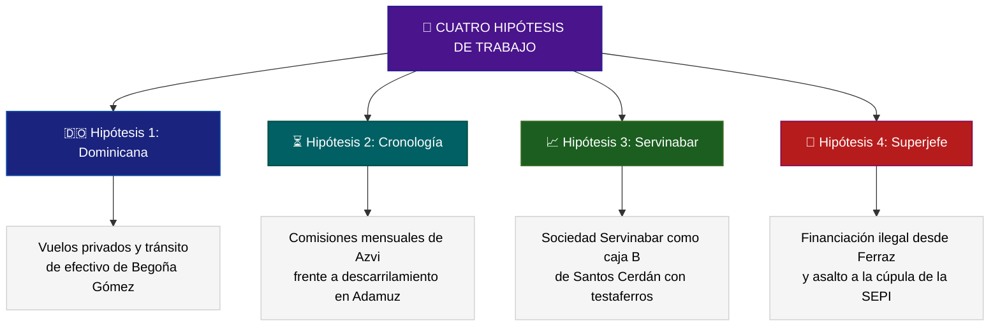

# 🔮 Conclusiones Analíticas e Hipótesis de Investigación Futura

Este informe final resume las **conclusiones estratégicas de inteligencia criminal** derivadas del cruce de datos y expone los vacíos o "silencios sospechosos" detectados en la información actual de la wiki. Asimismo, se formulan **cuatro hipótesis de investigación avanzadas** y se traza una guía dirigida de búsqueda en los archivos fuente de la carpeta `raw/` para profundizar en los nexos descubiertos.

---

## 1. Brechas de Información y Silencios Sospechosos

El análisis de consistencia e integridad de las causas judiciales ha desvelado importantes vacíos que parecen responder a estrategias de elusión procesal o a la intervención de las cloacas para desviar el foco judicial.

### A. La Trazabilidad Oculta de las Soldaduras de Redalsa
*   **El Vacío**: Aunque la jueza instructora de Montoro ha exigido con carácter de urgencia los certificados de calidad e informes de trazabilidad del tramo de vía del [[caso-adamuz]], los archivos de la wiki reflejan que [[adif]] y [[redalsa]] han demorado reiteradamente su entrega. 
*   **La Inconsistencia**: Falta el listado completo de los técnicos de Adif y directores de obra civil que firmaron y validaron las soldaduras defectuosas. La prisa del ministro Óscar Puente por retirar la vía siniestrada apunta a que la documentación original sobre la fatiga del carril podría haber sido destruida o manipulada antes de la inspección pericial independiente.

### B. Las Lagunas en el Drive de la SEPI
*   **El Vacío**: Los archivos del exdirector de la SEPI [[vicente-fernandez-guerrero]] incautados por la UCO en la **Operación Leire** contienen grandes lagunas temporales. Específicamente, se registra un sospechoso vacío en el drive de almacenamiento entre el verano de 2020 y mediados de 2021, coincidiendo con la tramitación álgida del rescate de Air Europa y la consolidación de la relación sentimental en Cabo de Gata entre Fernández y la ministra María Jesús Montero.
*   **La Implicación**: Es altamente probable que existieran purgas o borrados remotos de archivos antes de la entrada y registro de la Guardia Civil.

### C. La Ausencia Judicial de Antón Alonso en Licitaciones
*   **El Vacío**: A pesar de que la UCOMA identifica a **[[anton-alonso]]** (socio de Santos Cerdán en Servinabar) como el enlace directo que compró sociedades instrumentales para canalizar mordidas de Forestalia, su grado de imputación procesal en el Juzgado Central de Instrucción n.º 4 se mantiene secundario.
*   **La Sospecha**: El blindaje aforado de [[santos-cerdan-leon]] parece estar operando como un paraguas protector para evitar que la fiscalía tire de la manta sobre la triangulación de Servinabar.

---

## 2. Hipótesis de Investigación Avanzadas

A partir de los indicios lógicos y la proximidad de fechas clave, planteamos cuatro líneas de investigación criminal de alto nivel:

### Hipótesis 1: La Ruta Dominicana y el Tránsito del Efectivo
*   **Indicio**: La UCO ha acreditado 22 reuniones y viajes de [[maria-begona-gomez-fernandez]] a República Dominicana en vuelos privados costeados por empresarios turísticos vinculados al rescate de Air Europa.
*   **Planteamiento**: República Dominicana no representaba un mero destino de ocio, sino un **nodo logístico de tránsito de fondos offshore**. Víctor de Aldama y los directivos de Globalia contaban con pasarelas financieras en el Caribe. Proponemos investigar si la trama utilizó estos vuelos de afectación oficial libres de controles de aduanas estándar para trasladar capitales procedentes de las comisiones de la SEPI.

### Hipótesis 2: El Cruce Cronológico Koldo-Azvi-Adamuz
*   **Indicio**: Manuel Contreras (presidente de Azvi) pagaba una "mordida" mensual de 18.000 euros a Koldo García disfrazada de asesoría para LatAm.
*   **Planteamiento**: Existe una coincidencia temporal exacta entre los meses en que se firmaron las modificaciones presupuestarias y contratos de mejora del tramo Guadalmez-Adamuz (a cargo de Azvi) y los ingresos bancarios en efectivo y depósitos de Koldo. Sostenemos la hipótesis de que las comisiones mensuales de Azvi compraron el **silencio y la omisión de controles del ministerio** sobre la ejecución deficiente de las obras ferroviarias, lo que derivó a la postre en el colapso de la soldadura de Redalsa.

### Hipótesis 3: El Triángulo Servinabar - SEPI - Leire
*   **Indicio**: Leire Díez cobraba significativamente menos que sus socios técnicos en la empresa de Santos Cerdán y Vicente Fernández (ex-presidente de SEPI) custodiaba en su drive contratos inflados de Acciona.
*   **Planteamiento**: La estructura de Servinabar no era una consultoría real, sino una **caja B centralizada para el cobro de mordidas de obra pública de la SEPI**. Proponemos que Leire Díez operaba como "mujer de paja" o testaferro de Santos Cerdán, canalizando los fondos de las constructoras (Acciona/Azvi) mediante servicios ficticios de asistencia técnica, con el visto bueno del presidente de la SEPI debido a su vínculo íntimo y sentimental con la ministra de Hacienda, María Jesús Montero.

### Hipótesis 4: La Conexión del "Superjefe" y el Blindaje Total de SEPI y Ferraz
*   **Indicio**: En las escuchas del [[caso-sepi-cloacas]], Díez Castro alude a Pedro Sánchez como el *"superjefe"* al que recurriría para amarrar la jefatura de gabinete de [[belen-gualda-gonzalez]] en la SEPI, al tiempo que Cerdán León desviaba 178.000€ y aportaba personal, logística y dependencias de Ferraz para las cloacas.
*   **Planteamiento**: Sostenemos que el plan de desestabilización judicial no era una iniciativa aislada de Díez o Dolset, sino un **programa de blindaje institucional directo e ilimitado concebido en el núcleo de la Secretaría de Organización del PSOE y con el conocimiento del "superjefe"**. Proponemos investigar si la red criminal coordinaba las adjudicaciones amañadas del Clan Hirurok en la SEPI (132M€) para nutrir de forma sistemática la caja B nacional de Ferraz que sufragaba el espionaje a jueces e intentos de soborno a fiscales.

---

## 3. Recomendaciones de Búsqueda Dirigida en `raw/`

Para verificar y dotar de carga probatoria a estas hipótesis, recomendamos al usuario ejecutar una búsqueda de nuevos documentos o realizar lecturas profundas de los archivos ya almacenados en la carpeta de ingesta `raw/` utilizando los siguientes parámetros y términos clave:

1.  **Búsqueda sobre "República Dominicana" y Vuelos**:
    *   Términos clave: `República Dominicana`, `avión privado`, `jet privado`, `Hidalgo`, `vuelo Begoña`.
    *   Objetivo: Localizar diarios de vuelo, logs de tripulación o manifiestos de pasaje que confirmen quiénes acompañaron a Gómez en los 22 desplazamientos bajo sospecha.
2.  **Búsqueda sobre las Licitaciones de Guadalmez-Adamuz**:
    *   Términos clave: `Guadalmez`, `Montoro`, `trazabilidad Redalsa`, `soldadura`, `fatiga carril`.
    *   Objetivo: Encontrar correos o circulares internas de Adif anteriores al descarrilamiento que advirtieran del peligro técnico en las vías o cuestionaran la calidad de Redalsa.
3.  **Búsqueda sobre las Actas de Servinabar y Caliope**:
    *   Términos clave: `Servinabar`, `Next Generation Caliope`, `Antxon Alonso`, `Cerdán sociedad`.
    *   Objetivo: Rastrear escrituras de constitución, actas de juntas de socios o informes fiscales de la UCOMA que certifiquen el desvío de dividendos hacia el entorno familiar directo del secretario de organización del PSOE.
4.  **Búsqueda sobre Belén Gualda y Colocaciones en la SEPI**:
    *   Términos clave: `Belén Gualda`, `jefe de gabinete SEPI`, `superjefe`, `Zarrías facturas`, `Teijelo transferencias`.
    *   Objetivo: Extraer los correos, agendas o mensajes intervenidos a Díez y Cerdán que certifiquen el flujo documental de la facturación mendace de 178.000€ y el intento de chantaje a la dirección de la Fiscalía Anticorrupción.

---

## 4. Recomendación de Comandos Especiales (Slash Commands)

Para avanzar y automatizar estas líneas de análisis a nivel premium, animamos al usuario a explorar e iniciar los siguientes atajos de la interfaz:

*   **`/browser`**: Utiliza este comando para rastrear registros mercantiles actualizados de Dubái en busca de filiales activas de **Apamate Corporate and Trust**, o para monitorizar la publicación de autos judiciales recientes del Juzgado de Montoro sobre el caso Adamuz.
*   **`/goal`**: Activa este comando si deseas lanzar una tarea de rastreo y análisis masivo exhaustivo que asocie las bases de datos de contratación pública del Estado con las fechas de depósito bancario de los investigados en la trama Koldo.
