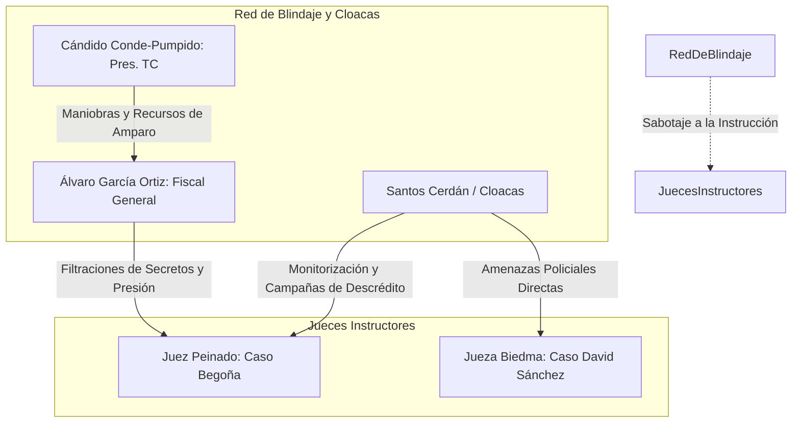

# 🌡️ Mapa de Calor de Corrupción Institucional y Captura del Estado

Este informe evalúa el grado de penetración, instrumentalización y captura de las diferentes estructuras de la Administración Pública española por parte de las tramas investigadas. Lejos de actuar de forma periférica, los comisionistas y mediadores lograron **establecer "nodos decisores" informales en el propio núcleo de ministerios, tribunales y empresas estatales estratégicas**, alterando procedimientos normativos y vulnerando los mecanismos de fiscalización.

---

## 1. El Eje Ministerio de Transportes / Adif / Renfe (El Núcleo Logístico)

El Ministerio de Transportes, Movilidad y Agenda Urbana (Mitma), junto con sus grandes entes públicos adscritos ([[adif]] y [[renfe]]), representa el **hotspot de máxima temperatura de la corrupción institucional**.

```
GRADO DE PENETRACIÓN: CRÍTICO (Nivel 5/5)
Organismos Afectados: Secretaría de Estado, Presidencia de Adif, Dirección de Renfe, Redalsa.
```

### Factores de Captura en Transportes:
1.  **El rol del Asesor Político**: [[koldo-garcia-izaguirre]] no actuaba como un técnico administrativo, sino como un **facilitador transversal con acceso ilimitado a la firma del ministro**. Su capacidad de influencia se extendió a la colocación de directivos dóciles en Adif (como Isabel Pardo de Vera, quien posteriormente recomendó abogados de la trama tras estallar el escándalo) y al control de compras públicas millonarias de material médico y obra civil.
2.  **La Alteración y Destrucción de Pruebas Procesales**: En el [[caso-adamuz]], tras el trágico descarrilamiento del tren Iryo que dejó 46 muertos, el propio ministro de Transportes, [[oscar-puente]], ordenó de forma exprés e injustificada la retirada y sustitución de **42 metros de vía siniestrada sin contar con la preceptiva autorización de la jueza instructora de Montoro**.
    *   **Implicación**: Esta maniobra, justificada políticamente como "restablecimiento de la circulación", constituye indiciariamente un delito de **encubrimiento y obstrucción a la justicia**, diseñado presuntamente para ocultar informes de fatiga de materiales y soldaduras ejecutadas de forma defectuosa por [[redalsa]] (filial de Adif en la que participan [[acciona]] y [[azvi]]).
3.  **Comisiones en Obra Civil Continua**: La adjudicación de tramos de vía como el Guadalmez-Adamuz bajo sospechas técnicas demuestra que Azvi operó durante años bajo un esquema de mordidas periódicas mensuales pagadas directamente a Koldo García.

---

## 2. La SEPI y el Ministerio de Hacienda (El Núcleo Financiero)

La Sociedad Estatal de Participaciones Industriales ([[sepi]]) y el Ministerio de Hacienda representan el **centro de desvío y concesión de recursos financieros estratégicos** del Estado.

```
GRADO DE PENETRACIÓN: MUY ALTO (Nivel 4.5/5)
Organismos Afectados: Consejo de Administración de la SEPI, Cúpula de Hacienda, Intervención General (IGAE).
```

### La Conexión Oculta de María Jesús Montero y Vicente Fernández:
Informes policiales y la denuncia de un testigo presencial ante la Guardia Civil han destapado una de las conexiones de influencia informal más graves del Ejecutivo:
*   **Vida de Pareja Oculta**: La exvicepresidenta del Gobierno y exministra de Hacienda, **María Jesús Montero**, mantuvo una relación sentimental directa e íntima ("vida de pareja") con el expresidente de la SEPI, **[[vicente-fernandez-guerrero]]**, compartiendo estancia en el Hotel Las Salinas de Cabo de Gata (Almería) en el verano de 2021.
*   **La Relevancia del Cese**: Montero cesó formalmente a Vicente Fernández en octubre de 2019 tras su imputación judicial en el caso de la mina de Aznalcóllar, declarando públicamente en reiteradas ocasiones ante los medios de comunicación que había cortado todo contacto y relación con el expresidente del holding estatal.
*   **Implicaciones en la Trama**: El testigo y los investigadores de la UCO sostienen que esta estrecha relación personal en la sombra desmiente la neutralidad del Ministerio de Hacienda en la fiscalización de las ayudas concedidas.
    *   **Operación Leire**: Vicente Fernández (expresidente de la SEPI) guardaba en su drive personal de almacenamiento archivos que acreditaban la manipulación técnica y el **inflado de contratos públicos** para favorecer a constructoras y desviar comisiones ilegales a través de [[leire-diez-castro]] y [[anton-alonso]] (socio de Santos Cerdán).

> [!IMPORTANT]
> **El Veto del Tribunal de Cuentas**: A este escenario se suma la insumisión de la presidenta del Tribunal de Cuentas, **Enriqueta Chicano**, quien ha desafiado a las Cortes Generales negándose a fiscalizar las ayudas del Fondo de Solvencia y ocultando graves irregularidades contables de la SEPI, tras ser denunciada formalmente por coacciones y prevaricación.

---

## 3. MITECO, INAGA y Tragsatec (El Núcleo Ambiental)

La tramitación de macro-parques de energías renovables en Aragón y otras comunidades autónomas revela la captura del Ministerio de Transición Ecológica (dirigido por Teresa Ribera) y el uso de empresas públicas instrumentales.

```
GRADO DE PENETRACIÓN: ALTO (Nivel 4/5)
Organismos Afectados: Secretaría de Estado de Energía, INAGA (Aragón), Tragsatec.
```

### Factores de Captura Ambiental:
*   **Tragsatec como Guardia Pretoriana**: En el [[caso-forestalia]], los informes de la UCOMA y declaraciones de trabajadores de la empresa pública Tragsatec demuestran que los directivos operaron como el brazo ejecutor privado de la promotora Forestalia. Los técnicos e ingenieros funcionarios que firmaban informes negativos o de impacto ambiental grave contra los proyectos de Fernando Samper Rivas **eran sistemáticamente apartados, aislados o depurados del servicio**, siendo sustituidos por personal subcontratado dispuesto a visar las Declaraciones de Impacto Ambiental (DIA) de forma urgente.
*   **Presión Directa en INAGA**: La identificación del director del INAGA, Jesús Lobera, como la figura central de presión política para liberar expedientes ambientales evidencia que la estructura administrativa del organismo autónomo fue anulada en favor de los intereses del socio de Cerdán, [[anton-alonso]], y de Forestalia.

---

## 4. Fiscalía General, Cloacas Policiales y Tribunal Constitucional (El Núcleo de Blindaje Judicial)

Para garantizar la impunidad de la jerarquía informal y neutralizar las investigaciones penales de jueces instructores independientes (como Juan Carlos Peinado en Madrid o Beatriz Biedma en Badajoz), la trama articuló una **red transversal de blindaje judicial y control institucional**.



### Mecanismos de Captura y Boicot Judicial:
1.  **La Fiscalía General del Estado (Álvaro García Ortiz)**:
    *   **Hecho Acreditado**: [[alvaro-garcia-ortiz]] ha sido **condenado en primera instancia** por la Sala Segunda del Tribunal Supremo por un delito de revelación de secretos, al haber ordenado la filtración masiva de datos confidenciales y correos electrónicos privados de la defensa de un investigado por fraude fiscal para contrarrestar informaciones de prensa molestas para Moncloa.
    *   **La Insumisión**: García Ortiz se ha negado a entregar sus dispositivos electrónicos y teléfonos al juzgado, contando con el blindaje de la Teniente Fiscal del Supremo, Ángeles Sánchez Conde, quien boicotea las diligencias de investigación patrimonial del magistrado Andrés Martínez Arrieta.
2.  **El Tribunal Constitucional (Cándido Conde-Pumpido)**:
    *   El TC, bajo la presidencia de Conde-Pumpido, opera como la última línea de defensa política: magistrados del propio tribunal denuncian que se está preparando una ponencia exprés para **declarar inconstitucional la investigación penal contra García Ortiz** y blindar mediante amparos contorsionistas al expresidente Zapatero y las tramas de la SEPI.
3.  **Las Cloacas y Mandos Sanchistas Policiales**:
    *   **Monitorización de Jueces**: Se investiga el espionaje y seguimiento ilegal de agentes de las cloacas de Interior a los jueces instructores Peinado y Biedma.
    *   **Boicot de Diligencias**: La UDEF y mandos de la Comisaría General de Policía Judicial paralizaron durante meses la entrega al juez Calama de los informes sobre los vuelos de Plus Ultra y el origen venezolano del dinero para impedir la imputación de Zapatero y el cese de Montero.
