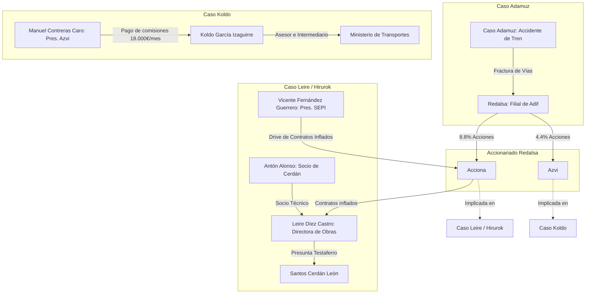
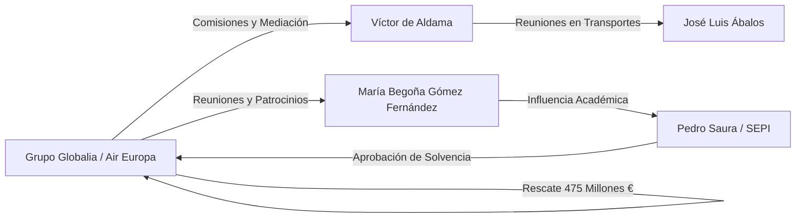

# 🧠 Matriz de Conexiones No Evidentes y Redes Cruzadas

Este informe de inteligencia criminal expone los **nexos ocultos, ramificaciones transnacionales e interconexiones societarias** detectadas tras el cruce exhaustivo del contenido de la wiki. A través de este análisis se demuestra que tramas aparentemente aisladas—como un accidente de tren en Córdoba, un rescate de aerolíneas, licitaciones de parques eólicos en Aragón o cátedras universitarias en Madrid—comparten un **elenco común de intermediarios, testaferros, empresas pantalla y facilitadores logísticos**.

---

## 1. El Nexo de Obras Públicas e Infraestructuras (Acciona - Azvi - Koldo - Leire - Adamuz)

Una de las conexiones más sutiles y de mayor gravedad técnica y penal descubiertas en este cruce conecta directamente la tragedia ferroviaria del [[caso-adamuz]] con el tráfico de influencias del [[caso-koldo]] y el presunto amaño de licitaciones del [[caso-leire-hirurok]].

### Tabla de Intersecciones: Sector de Obra Civil e Infraestructuras

| Entidad / Actor | Presencia en [[caso-adamuz]] | Presencia en [[caso-koldo]] | Presencia en [[caso-leire-hirurok]] / [[caso-cerdan]] |
| :--- | :--- | :--- | :--- |
| **[[azvi]]** | Propietaria del 4.4% de [[redalsa]] (empresa que ejecutó las soldaduras defectuosas en Adamuz). | Investigada por el pago de comisiones irregulares en adjudicaciones. | N/A |
| **[[manuel-contreras-caro]]** | Presidente de Azvi. Empresa sospechosa por la obra civil del tramo de vía Guadalmez-Adamuz. | Investigado por pagar un sueldo de 18.000€/mes a Koldo García bajo el pretexto de una asesoría para LatAm. | N/A |
| **[[acciona]]** | Propietaria del 8.8% de [[redalsa]]. | Adjudicataria de contratos de mascarillas bajo sospecha de la UCO. | Investigada por contratos inflados y canalización de comisiones a directores de obra pública. |
| **[[adif]]** | Titular de la infraestructura ferroviaria siniestrada. | Organismo que adjudicó compras de mascarillas a Soluciones de Gestión. | Ente auditado por el inflado de obras y licitaciones manipuladas bajo control de Transportes. |
| **[[koldo-garcia-izaguirre]]** | N/A | Asesor de Transportes y receptor directo de los pagos del presidente de Azvi. | Enlace político para contratos de obra civil con el Ministerio de Transportes. |
| **[[santos-cerdan-leon]]** | N/A | Investigado por amnesia en el Senado respecto a comisiones de la trama. | Enlace principal a través de su socio [[anton-alonso]] y la presunta testaferro [[leire-diez-castro]]. |

---

## 2. La Conexión Venezolana y el Eje Petro-Financiero (Zapatero - Delcy - Plus Ultra - PDVSA)

El cruce de datos patrimoniales y societarios revela que la intermediación internacional de la diplomacia informal opera como un **mecanismo de financiación y desvío de capitales** que une el [[caso-zapatero]] con el [[caso-plus-ultra]], el [[caso-air-europa]] y el [[caso-koldo]].

### La Pasarela de Dubái y los Cupos de PDVSA
El magistrado José Luis Calama e informes clave de la UDEF han acreditado la existencia de una estructura de canalización financiera internacional:
1.  **Canalización de Crudo**: La red liderada por el expresidente [[jose-luis-rodriguez-zapatero]] habría utilizado la mercantil **Apamate Corporate and Trust** en Dubái como receptora de cupos de petróleo adjudicados por PDVSA.
2.  **Volumen Financiero**: Se investiga la introducción en la Unión Europea de un sobre/fondo con **250 millones de dólares** gestionado a través de la intermediación de [[victor-de-aldama-delgado]].
3.  **El Aterrizaje del Dinero**:
    *   **Plus Ultra**: El rescate de **53 millones de euros** concedido por la [[sepi]] a [[plus-ultra-lineas-aereas]] fue celebrado y confirmado por la trama antes de la aprobación del Consejo de Ministros. Los fondos de la aerolínea se conectan con transferencias a cuentas de familiares de altos cargos del Gobierno.
    *   **Desvíos a Jésica**: Informes policiales constatan pagos de la trama Plus Ultra para sufragar los gastos de la vida de lujo de Jésica Rodríguez (exnovia del exministro [[jose-luis-abalos-meco]]), incluyendo el alquiler del piso de Plaza de España en Madrid y billetes de vuelos oficiales.

> [!WARNING]
> **⚠️ Contradicción de Cargo y Descargo**: Mientras el presidente de Plus Ultra, Julio Martínez, negó categóricamente en sede judicial haber recibido ayuda o intermediación de Moncloa o de Ábalos, los mensajes interceptados por la UDEF revelan que la trama festejó la concesión del rescate días antes del acuerdo del Consejo de Ministros, aludiendo directamente a la presión ejercida por Zapatero y Delcy Rodríguez.

---

## 3. El Eje de los Rescates de la SEPI y la Influencia Académica (Globalia - Air Europa - Begoña Gómez)

El análisis del [[caso-air-europa]] y el [[caso-begona-gomez]] revela un patrón idéntico de instrumentalización institucional para obtener solvencia financiera y contratos públicos mediante relaciones de asimetría e influencia directa en la Presidencia del Gobierno.

### Elementos de Interconexión:
*   **El rol de Víctor de Aldama**: Comisionista del [[grupo-globalia]] (con un contrato de asesoría y cobro de comisiones acreditado) al mismo tiempo que operaba como comisionista central en la trama de compras sanitarias de la mano de [[koldo-garcia-izaguirre]].
*   **Las Reuniones Tripartitas**: La UCO ha certificado que [[maria-begona-gomez-fernandez]] mantuvo al menos 22 reuniones y encuentros personales con Javier Hidalgo (CEO de Globalia) en las mismas fechas en que se negociaba el rescate de **475 millones de euros** de la [[sepi]] para Air Europa.
*   **El Retorno del Favor**: Globalia patrocinó eventos del IE Africa Center (dirigido por Gómez) y financió viajes a República Dominicana de la investigada en aviones corporativos privados, mientras Begoña Gómez firmaba cartas de recomendación que facilitaban a consultoras como la de [[juan-carlos-barrabes-consul]] la obtención de contratos tecnológicos financiados con fondos públicos.

---

## 4. La Red Transversal de Forestalia (Teresa Ribera - Samper - Cerdán - Antón Alonso)

El [[caso-forestalia]] revela la existencia de una red de tráfico de influencias que asalta la tramitación de licitaciones macro-renovables y que comparte enlaces directos con la cúpula del PSOE de [[santos-cerdan-leon]].

*   **El Enlace Servinabar**: El socio técnico de Santos Cerdán, **[[anton-alonso]]** (con quien compartía el 45% de la mercantil Servinabar), figura en los informes de la UCOMA como el **enlace directo** que conectaba al presidente de Forestalia, Fernando Samper Rivas, con un alto cargo del Ministerio de Transición Ecológica dirigido por Teresa Ribera.
*   **La Compra de Sociedades Interpuestas**: Los investigadores detectaron que Antón Alonso adquirió la sociedad *Next Generation Caliope Innova* en 2022, la cual operó como pasarela para canalizar fondos y agilizar licitaciones ambientales que estaban siendo bloqueadas por funcionarios técnicos en el [[el-instituto-aragones-de-gestion-ambiental-represa|INAGA]] de Aragón.
*   **Testaferros Compartidos**: La UCO sospecha que [[leire-diez-castro]] actuaba como testaferro cruzado de la red de Cerdán y Alonso en obra pública, debido a la disparidad salarial y la falta de capacidad técnica para la gestión de los contratos multimillonarios de infraestructuras asignados.

---

## 5. Resumen Analítico de Entidades y Cuentas Opacas

| Canal de Tránsito / Entidad Opaca | Origen de Fondos | Destino de Fondos | Investigados Clave | Caso Asociado |
| :--- | :--- | :--- | :--- | :--- |
| **Apamate Corporate and Trust (Dubái)** | Cupos de Petróleo de PDVSA | Cuentas en el Extranjero y Financiación Política | [[jose-luis-rodriguez-zapatero]], [[victor-de-aldama-delgado]] | [[caso-zapatero]] |
| **Fondo de Solvencia SEPI (España)** | Fondos Públicos de Emergencia | [[plus-ultra-lineas-aereas]], [[grupo-globalia]] | [[vicente-fernandez-guerrero]], Javier Hidalgo | [[caso-plus-ultra]], [[caso-air-europa]] |
| **Servinabar (Navarra/España)** | Comisiones de Obra Pública | Cuentas Particulares y Campañas | [[anton-alonso]], [[santos-cerdan-leon]] | [[caso-cerdan]], [[caso-leire-hirurok]] |
| **Next Generation Caliope Innova** | Adjudicaciones Eólicas | Tránsito Societario de Licitaciones | [[anton-alonso]], Fernando Samper | [[caso-forestalia]] |
| **Redalsa S.A.** | Presupuesto de Adif | Adjudicatarias [[acciona]] y [[azvi]] | [[manuel-contreras-caro]], Óscar Puente | [[caso-adamuz]] |
