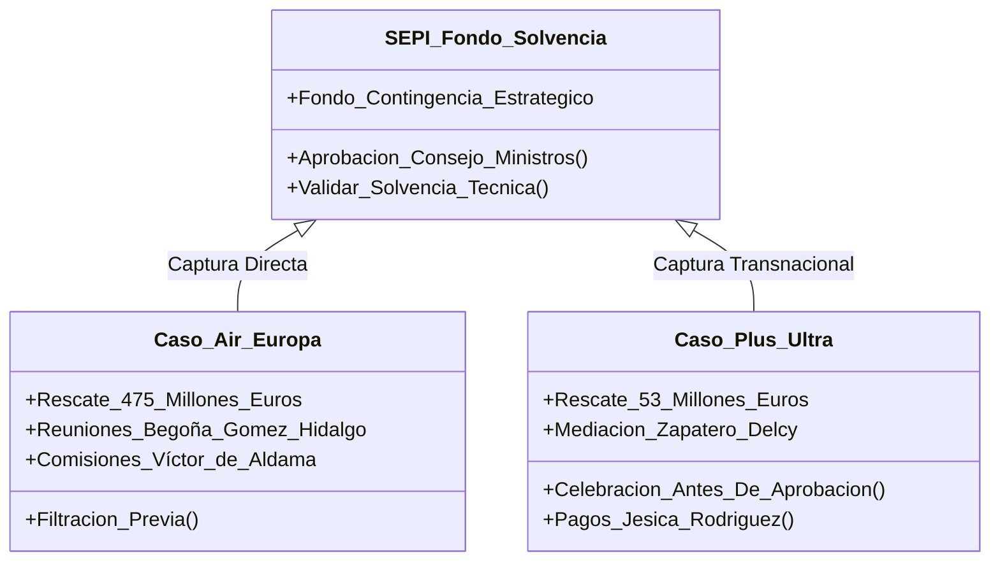

# 🕵️‍♂️ Tipologías de Fraude y Patrones de Modus Operandi

Este informe realiza un análisis técnico comparativo de los **métodos delictivos, técnicas de elusión fiscal, blanqueo de capitales y asalto a la contratación pública** implementados de forma reiterada por las diferentes redes criminales indexadas. El análisis evidencia que los delincuentes de cuello blanco e intermediarios políticos repiten estructuras organizativas y de triangulación de fondos, adaptando su ejecución según el marco administrativo correspondiente.

---

## 1. Técnicas de Blanqueo de Capitales y Elusión Financiera

El cruce de datos identifica tres niveles estructurados para la introducción, lavado y ocultación de capitales ilícitos procedentes de mordidas y comisiones en obra pública, contratos sanitarios o contrabando internacional.

```
Nivel 1: Efectivo e Intermediarios ("Chistorras" y Bolsas)
   ↳ Koldo: Billetes de 500€ ("chistorras") para uso diario y desvíos familiares.
   ↳ Mediador: Entregas de 5.000€ en efectivo en clubs y hoteles de Madrid.

Nivel 2: Fundaciones y Triangulación Nacional
   ↳ Mediador: Transferencias camufladas como donaciones a fundaciones y clubes deportivos.
   ↳ Leire/Cerdán: Servinabar como sociedad de servicios para justificar cobros técnicos.

Nivel 3: Ingeniería Financiera Offshore y Fideicomisos
   ↳ Zapatero/Venezuela: Fideicomiso "Apamate Corporate and Trust" en Dubái.
   ↳ Forestalia: Next Generation Caliope Innova para el tránsito de licitaciones y blanqueo.
```

### A. El Efectivo y la Jerga Interna ("Chistorras" vs. "Sobres")
*   **Caso Koldo**: El exasesor [[koldo-garcia-izaguirre]] ha admitido en sede judicial la recepción y el manejo constante de fajos de billetes de 500 euros, a los que la trama denominaba en su jerga criminal **"chistorras"**. La UCO acreditó el hallazgo de más de **387.000 euros en efectivo** en el entorno familiar del exasesor, dinero que era utilizado para costear gastos cotidianos, kilometrajes y desvíos financieros con el fin de eludir el rastro bancario y ocultar los ingresos reales a la Hacienda Pública.
*   **Caso Mediador**: La red de [[antonio-navarro-tacoronte]] y el exdiputado [[juan-bernardo-fuentes-curbelo]] ("Tito Berni") exigía a los empresarios del sector primario un "peaje" de entrada de **5.000 euros en efectivo**, dinero entregado en mano en hoteles o despachos oficiales para abrir la puerta a licitaciones o archivar sanciones ganaderas de la UE.

### B. La Triangulación a través de Fundaciones e Instrumentales Nacionales
*   **La Pantalla del Deporte**: En el [[caso-mediador]], el dinero negro se "lavaba" mediante transferencias bancarias dirigidas a la *Asociación Deportiva Vega Tetir* y otras entidades sin ánimo de lucro controladas por la trama política canaria, simulando donaciones legítimas o patrocinios deportivos para evitar las alertas de blanqueo bancario.
*   **La Pantalla de Servicios**: En el [[caso-cerdan]] y [[caso-leire-hirurok]], la sociedad **Servinabar** (cuyo 45% pertenecía a [[santos-cerdan-leon]]) operaba presuntamente para justificar flujos financieros. La UCO sostiene que [[leire-diez-castro]] cobraba importes sustancialmente inferiores en comparación con sus socios técnicos, lo que indicaría que operaba como una "testaferro de paja" para encubrir la entrada de mordidas canalizadas a través del cobro de servicios de consultoría o ingeniería inexistentes.

### C. La Ingeniería Transnacional y Cuentas Ocupadas
*   **La Conexión Dubái**: En el [[caso-zapatero]], la organización criminal utilizó la pasarela de **Apamate Corporate and Trust** en los Emiratos Árabes Unidos (Dubái) para eludir el control fiscal europeo, canalizando allí comisiones procedentes de la venta y cupos de crudo pesado de la estatal PDVSA.
*   **Las Empresas de Licitación**: En el [[caso-forestalia]], la Guardia Civil y la UCOMA detectaron que la sociedad *Next Generation Caliope Innova*, adquirida por [[anton-alonso]] (socio de Santos Cerdán), sirvió como vehículo mercantil para transferir derechos de proyectos ambientales y licitaciones energéticas por importes millonarios, operando con notarios investigados por blanqueo en la misma red.

---

## 2. Alteración de Licitaciones y Captura del Procedimiento Público

El asalto a los presupuestos públicos se ejecuta mediante dos patrones repetitivos que anulan la concurrencia competitiva y la neutralidad de los funcionarios técnicos.

### A. El Abuso del Procedimiento de Contratación de Emergencia (COVID-19)
La trama del [[caso-koldo]] e [[caso-abalos]] instrumentalizó el marco excepcional de la pandemia del COVID-19. Utilizando la normativa de contratación de emergencia (que permite la adjudicación directa sin publicidad ni licitación previa), la empresa pantalla *Soluciones de Gestión* (sin experiencia previa en el sector sanitario y prácticamente inactiva) obtuvo contratos por más de **53 millones de euros** en ministerios y gobiernos autonómicos (Baleares y Canarias). 

### B. El Mecanismo de Presión Ambiental y Purga de Técnicos (Forestalia)
En el [[caso-forestalia]], ante la imposibilidad de aplicar la contratación de emergencia, la trama de Fernando Samper recurrió al **mecanismo de presión institucional exprés**:
*   **El Nódulo de Presión**: Jesús Lobera, director del [[el-instituto-aragones-de-gestion-ambiental-represa|INAGA]], ha sido identificado por los investigadores de la UCOMA como la "figura central" de presión para la agilización irregular de declaraciones de impacto ambiental (DIA).
*   **La Guardia Pretoriana**: Se constató el uso de la empresa pública **Tragsatec** como un instrumento operativo privado de la trama. Los directivos de Tragsatec apartaban sistemáticamente a los técnicos ambientales e ingenieros funcionarios que firmaban informes negativos o de impacto grave contra los parques macro-renovables de Forestalia, sustituyéndolos por técnicos externos dóciles dispuestos a visar las declaraciones exprés.

---

## 3. Asalto e Instrumentalización de Fondos Estatales de Solvencia (SEPI)

El Fondo de Apoyo a la Solvencia de Empresas Estratégicas gestionado por la [[sepi]] se convirtió en el principal hotspot de codicia y tráfico de influencias de las tramas de alto nivel político.



### Patrón Repetitivo de Manipulación en los Rescates:
1.  **Filtración y Anticipación**: Tanto en el rescate de Air Europa (**475 millones de euros**) como en el de Plus Ultra (**53 millones de euros**), la UCO y la UDEF han demostrado que los directivos de las aerolíneas y comisionistas de las tramas **festejaron y confirmaron por escrito la concesión de las ayudas días antes** de que el Consejo de Ministros las votara y aprobara formalmente.
2.  **Negociación Paralela / Conflicto de Interés**: Las comisiones eran negociadas de forma directa y presencial por Víctor de Aldama e Hidalgo en los propios despachos oficiales del Ministerio de Transportes con la participación activa del entonces ministro Ábalos y del presidente de Paradores, Pedro Saura. En paralelo, [[maria-begona-gomez-fernandez]] mantenía reuniones directas con Javier Hidalgo para amarrar patrocinios de sus eventos universitarios, cerrando el círculo del tráfico de influencias privado en la misma mesa de la Presidencia del Gobierno.
3.  **Destino Final de los Fondos de Solvencia**: En lugar de destinarse en exclusiva a garantizar la operatividad de las aerolíneas estratégicas, una parte sustancial de la liquidez liberada fluyó hacia comisiones de intermediación de Aldama (quien compró propiedades de lujo y coches deportivos) y desvíos financieros para sufragar el tren de vida de altos cargos de Transportes y familiares políticos directos.
